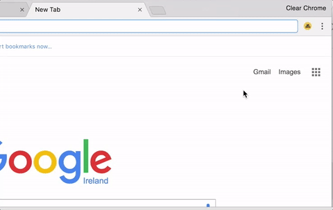

## Next Bus

#### What is Next Bus?
Next Bus is a Chrome Browser Extension that helps you to be in touch with your bus/train/ferry and do not miss the next one.  

Available schedules:  
* **Dublin Buses**
* *[Add your favourite transport API. See [how-to](#how-to-add-your-bustrainferry-api)]*

#### How it works?

#### How to add your bus/train/ferry API?

That should be easy as hell.   
All you need to do is just create new object here: `app/js/src/utils/cities.js`  
With 3 necessary fields:   
1. `url` -- a string with url endpoint to your API. Extension will make http GET request to endpoint once per minute (see `app/js/src/config.js`).   
2. `paramsBuilder` -- a function that should build query object for API request from extension state object.   
3. `responseHandler` -- a function that should handle API response: build object with new data about next buses, or with errors from API.  

If you have any questions, please look at jsDoc in `app/js/src/utils/cities.js`.  
Or just ask me ;)  

#### Roadmap

  
Done

  * mvp  
  * api call abstraction for other cities  
  * draw interface  
  * beautify view  
  * icons  
  * linter and precommit checking  
  * browserify + babelify + watchify + sourcemapify ... wtffy is going on with this -fy?  
  * Make errors from background page explicit  
  * move setInterval renew from popup to background script (demon script renew list with setTimeout(xhr) )  
  * Promises  
  * jsdoc  
  * renew extension icon so user don't have to open popup for checking the bus (badge)  
  * Licence  
  * add bus id input  
  * README.md  
  * Contribute instructions for other cities

  
Todo

  * Try to follow "Contribute instructions for other cities" and add new api: NYC/... api  
  * about page in Chrome Web Store    
  * tests. Hmm should start with them next time :)  
  * Google Analytics counter. (What is it for?)    
  * Add FF, Safari, etc.  
  * Add ability to add stops from map  
  * Add some static API  
  * Add ability to add API privately (== locally)  

#### The Story
On my previous job, our office building was far far away from the closest metro station.  
Our company provide comfortable buses with a nice schedule to help us get from the metro station to the office and return after a workday back.  
I was always able to open the schedule and find out when I should leave the office to catch the bus just in time and not waiting on a street.  

But if you don't want to miss your next bus, you should always have the schedule opened in front of you.  
Also, you don't need all schedule; you need only the next bus, the one that will get you to home.  
With all this assumptions, my ex-colleague, [@ortemij](https://github.com/ortemij), has created a browser extension [benua-helper](https://github.com/ortemij/benua-helper).  

  
*Benua is a name of the office building in the middle of Saint Petersburg, Russia. It's gorgeous. It was named after Alexandre Benois, famous Russian artist. Look at his [paintings](https://www.wikiart.org/en/alexandre-benois).*  

`benua-helper` was extremely helpful and all our office (700+ people) using it every day.  
Thank you [@ortemij](https://github.com/ortemij) for saving our time so many times! ;)  

When I change my job and move to a different city, I miss that extension a lot.  
After a while, I've decided to create my own schedule-helper-extension.  
Not only for my new office, but with an ability for everyone to add their API for any buses, or trains, or ferries.     

Why I just didn't add some new functionality to `benua-helper`?  
 1. I was wondering how browser extensions work. And the best learning strategy for me is a creating smth from scratch;  
 2. `benua-helper` extension has more specific interface than I need; 
 3. It wasn't clearly how to carefully add a configurable mechanism for city transport data API and do not break everything in `benua-helper`.

#### Thank you, Nick!
You're welcome!  
 
 
Please, :star: this repo and rate [Next Bus Extension](TODO chrome extension shop link) in Chrome Web Store.  
Welcome for issues and comments.  
And of course, add your transport APIs ;)
